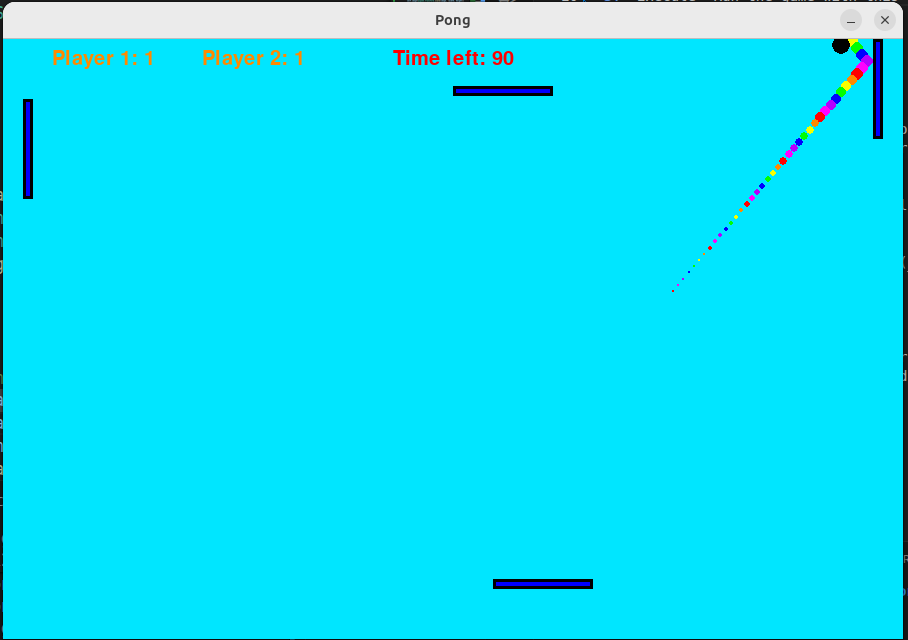

# PongPygame
A 2 player game of pong with fun visuals and a bonus of there being two paddles at the top and bottom to be able to have a stategy and mess with the other person. The ball wil also speed up everytime it gets hit.

## Includes
*   **Easy to learn** Clear instructions provided at the start with only the arrow and wasd kays being used
*   **Fun visuals** A bright and colourful game with a rainbow trail of balls following the main one
*   **Changable game lengths** Choose between going for 1, 2, or 3 minutes or until someone reaches 3, 5, or 10 points

## Installation
this assumes you have python installed, a venv is recommended, but not required.
*   git checkout
install library/dependencies e.g

pip install -r requirements.txt
python pong.py
## How to play

*   Read the instructions at the start of the program
*   Choose the number of trailing balls by typing it
*   Choose when the game ends by pressing the corresponding button
*   Use the w and s keys to move the left paddle and the up and down keys to move the right paddle. These paddles are just for fun and only serve to annoy the other player
*   Points are awarded when the ball passes the paddle and collides with the edge
*   Game ends when the chosen parameters for ending are achieved

## Building from source
